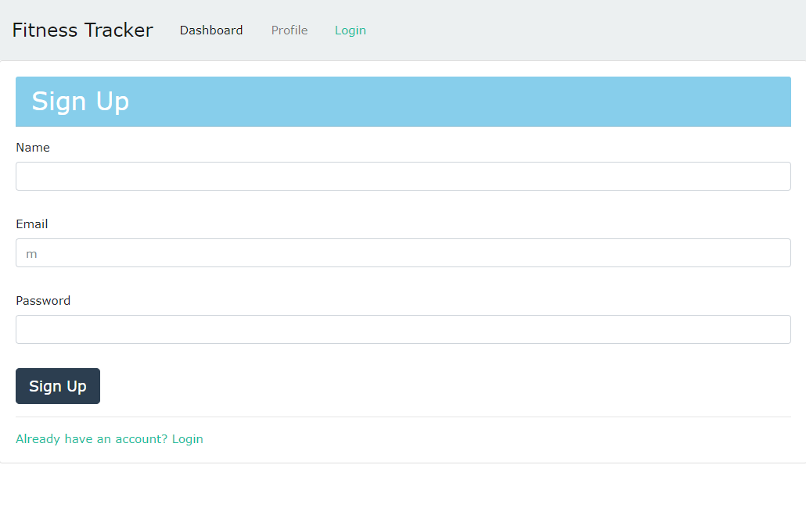
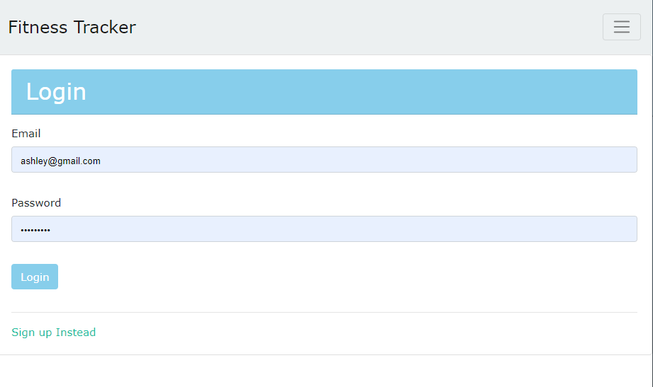
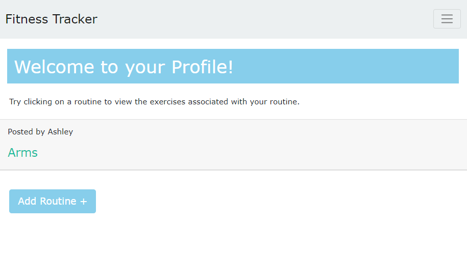
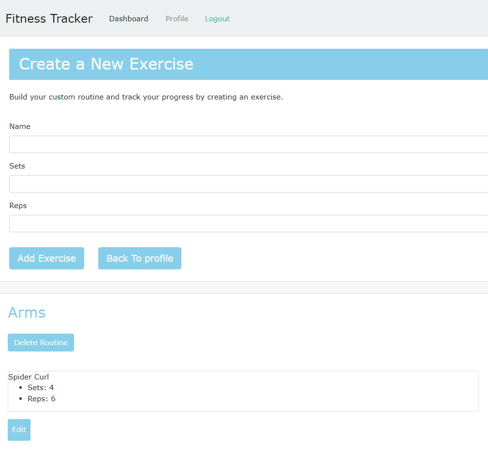
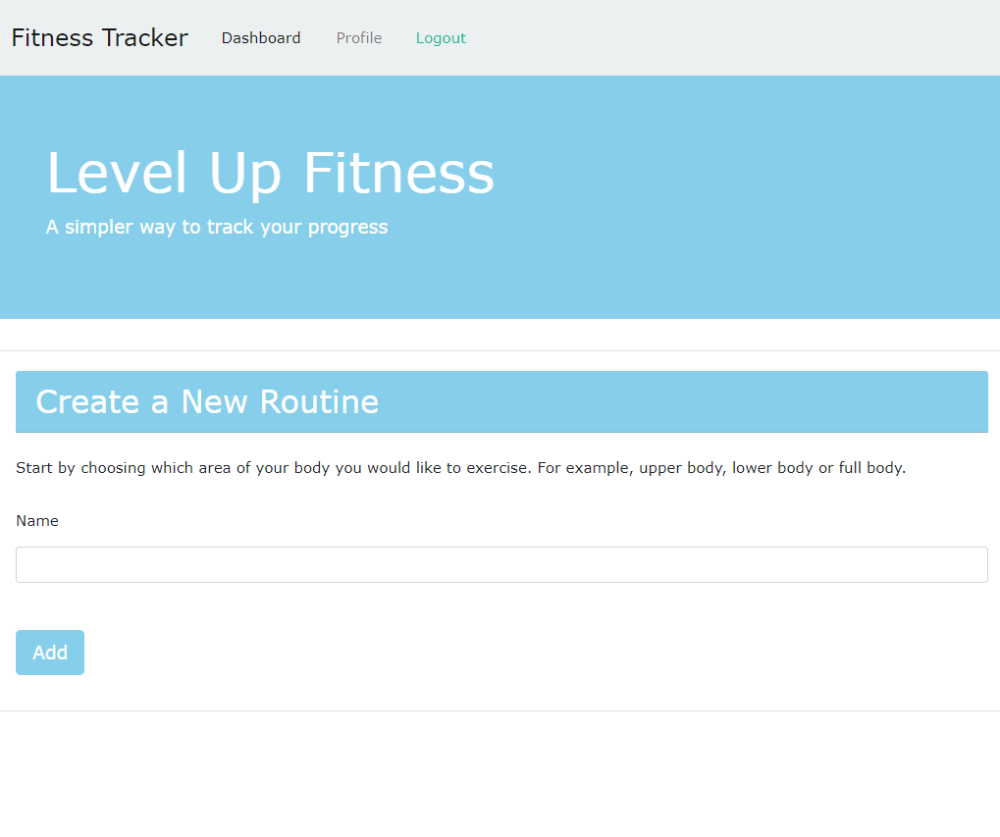
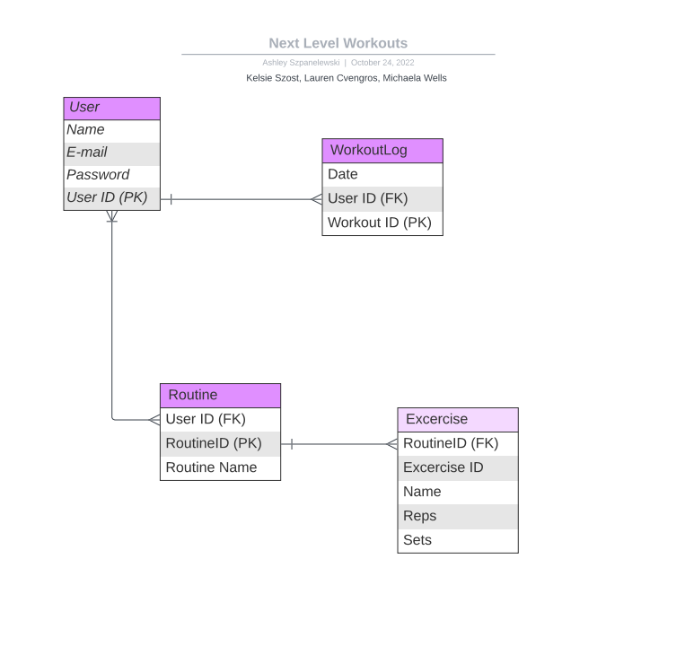

# Level Up Fitness

[Deployed Level Up Fitness App ](https://levelup-fitness.herokuapp.com/ "Level Up Fitness")

## Table-of-Contents

1. [Description](#description)

2. [Intallation](#installation)

2. [Technology](#technology)

3. [Photos](#photos)

4. [Collaborators](#Collaborators)


## Description:

The purpose of this application is to simplify the process of tracking your work outs. 
By signing up or logging in, you can create or modify workouts and review what you have saved from last time.
-More of what you need, less of what you don't

## Installation 

* To run this application follow these steps:

    ```
    1. clone the repository using https or SSH
    2. run npm i
    ```
* open mysql2 by using: mysql -u root -p

    ```
    1. enter your SQL password
    2. input source db/schema.sql
    3. use ecommerce_db
    ```

* Exit mysql by running "quit", then enter:

    ```
    1. npm run seed
    2. npm start or node server.js
    ```

## Technology:

- RESTful API using Node.js and Express.js
- Handlebars.js as the template engine
- MySQL and Sequelize ORM for the database
- Authentication
- Deployment to Heroku using MySQL JawsDB
- dotENV

## Photos:
- View of the Sign Up Page:


- View of the Login Page:


- View of the Profile landing page:


- View of Profile with Routine expanded:


- View of Dashboard:


- Entity Relationship Diagram (ERD):


## Collaborators:

This application was developed and deployed by:

- Lauren Cvengros [l.cvengros@icloud.com]
- Michaela Wells []
- Kelsie Szost [owner@kelsieszost.design]
- Ashley Szpanelewski [ashleyszp@gmail.com]